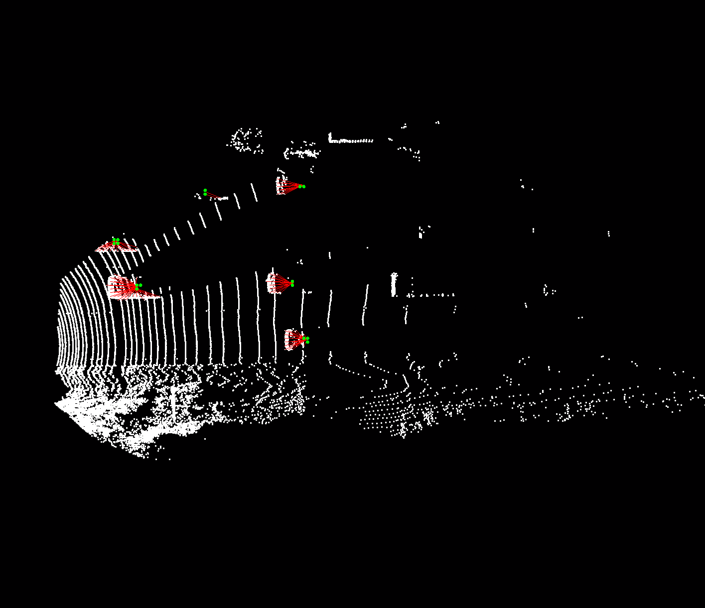

## Semantic-aware 3D-voxel CenterNet for point cloud object detection
## All code will be released upon publication of the paper.
## More detailed results of our SA-voxel-centernet are on the http://www.cvlibs.net/datasets/kitti/eval_object_detail.php?&result=6832bef733b8ae207539e5dbb9d186f572ab8959

* src file can get offset as this

  

